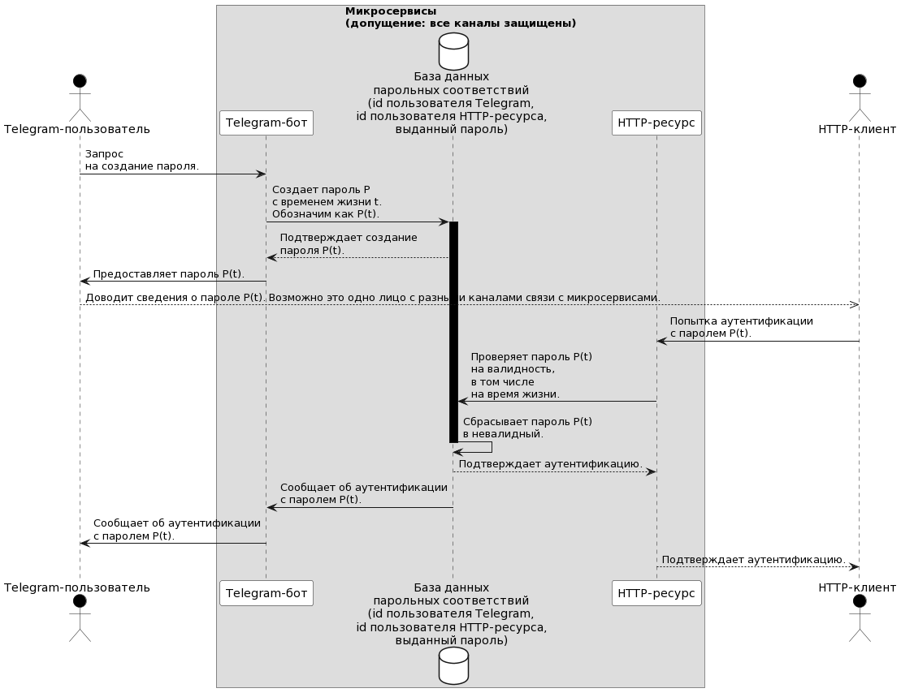

# Two-factor authentication

__Замечание__: рассматриваются только положительные варианты развития событий.

## Обобщенное описание

Диаграмма последовательностей запросов и ответов:


<details>
<summary>см. код для генерации схемы на сайте https://plantuml.com</summary>

```text
@startuml
actor "Клиент-Заявитель" as Client_1 #000

box "SERVICES"
    box "Микросервисы\n(допущение: все каналы защищены)"
        participant   "Сервис создания\nпароля" as Service_1 #FFF
        database      "База данных\nпарольных соответствий\n(id заявителя,\nid потребителя,\nвыданный пароль)" as Database #FFF
        participant   "Сервис-провайдер\nданных" as Service_2 #FFF
    end box
end box

actor "Клиент-Потребитель" as Client_2 #000

Client_1          ->   Service_1  : Запрос\nна создание пароля
Service_1         ->   Database   : Создает пароль P\nс временем жизни t.\nОбозначим как P(t).

activate Database #000

Database          -->  Service_1  : Подтверждает создание\nпароля P(t).
Service_1         ->   Client_1   : Предоставляет пароль P(t).

Client_1          -->>  Client_2  : Доводит сведения о пароле P(t).

Client_2          ->   Service_2  : Попытка аутентификации\nс паролем P(t).
Service_2         ->   Database   : Проверяет пароль P(t)\nна валидность,\nв том числе\nна время жизни.

Database          ->   Database   : Сбрасывает пароль P(t)\nв невалидный.

deactivate Database

Database         -->   Service_2  : Подтверждает аутентификацию.
Database          ->   Service_1  : Сообщает об аутентификации\nс паролем P(t).
Service_1         ->   Client_1   : Сообщает об аутентификации\nс паролем P(t).
Service_2        -->   Client_2   : Подтверждает аутентификацию.

@enduml
```

</details>

## Описание на примере протоколов Telegram и HTTP



<details>
<summary>см. код для генерации схемы на сайте https://plantuml.com</summary>

```text
@startuml
actor "Telegram-пользователь" as Client_1 #000

box "SERVICES"
    box "Микросервисы\n(допущение: все каналы защищены)"
        participant   "Telegram-бот" as Service_1 #FFF
        database      "База данных\nпарольных соответствий\n(id пользователя Telegram,\nid пользователя HTTP-ресурса,\nвыданный пароль)" as Database #FFF
        participant   "HTTP-ресурс" as Service_2 #FFF
    end box
end box

actor "HTTP-клиент" as Client_2 #000

Client_1          ->   Service_1  : Запрос\nна создание пароля.
Service_1         ->   Database   : Создает пароль P\nс временем жизни t.\nОбозначим как P(t).

activate Database #000

Database          -->  Service_1  : Подтверждает создание\nпароля P(t).
Service_1         ->   Client_1   : Предоставляет пароль P(t).

Client_1          -->>  Client_2  : Доводит сведения о пароле P(t). Возможно это одно лицо с разными каналами связи с микросервисами.

Client_2          ->   Service_2  : Попытка аутентификации\nс паролем P(t).
Service_2         ->   Database   : Проверяет пароль P(t)\nна валидность,\nв том числе\nна время жизни.

Database          ->   Database   : Сбрасывает пароль P(t)\nв невалидный.

deactivate Database

Database         -->   Service_2  : Подтверждает аутентификацию.
Database          ->   Service_1  : Сообщает об аутентификации\nс паролем P(t).
Service_1         ->   Client_1   : Сообщает об аутентификации\nс паролем P(t).
Service_2        -->   Client_2   : Подтверждает аутентификацию.

@enduml
```

</details>
